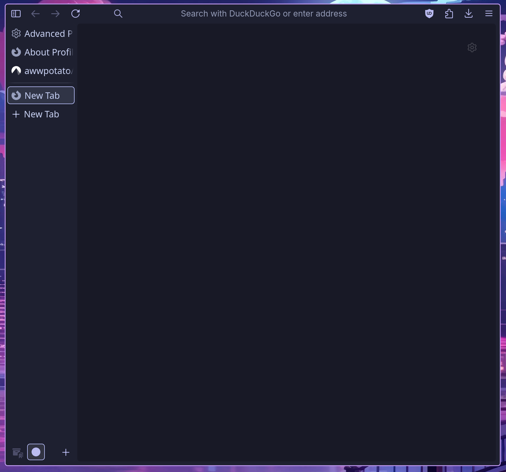
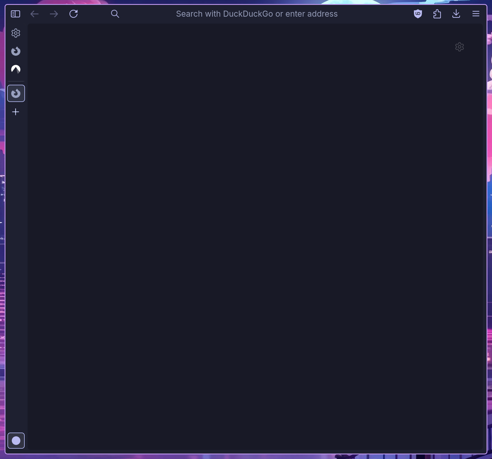
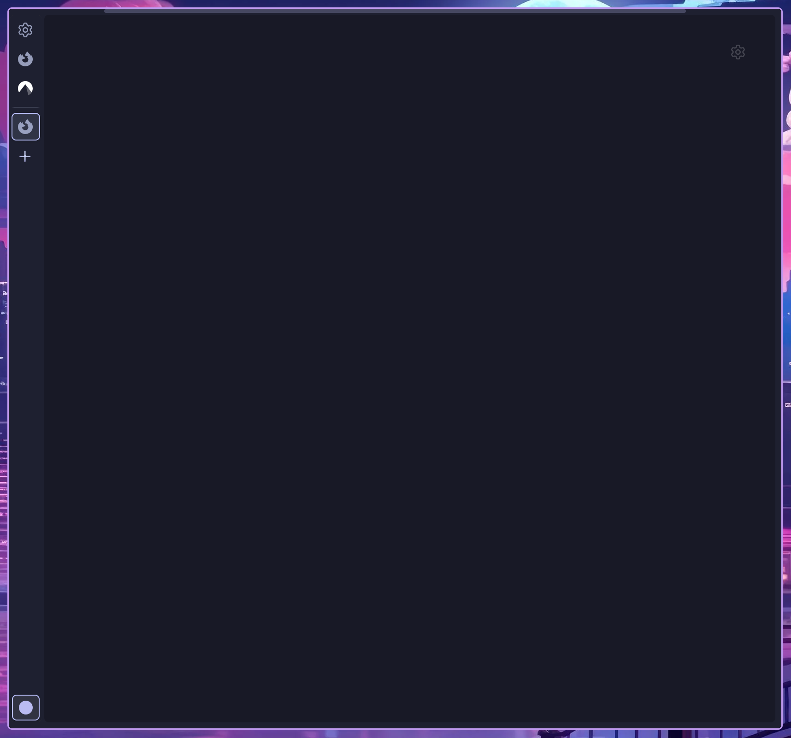
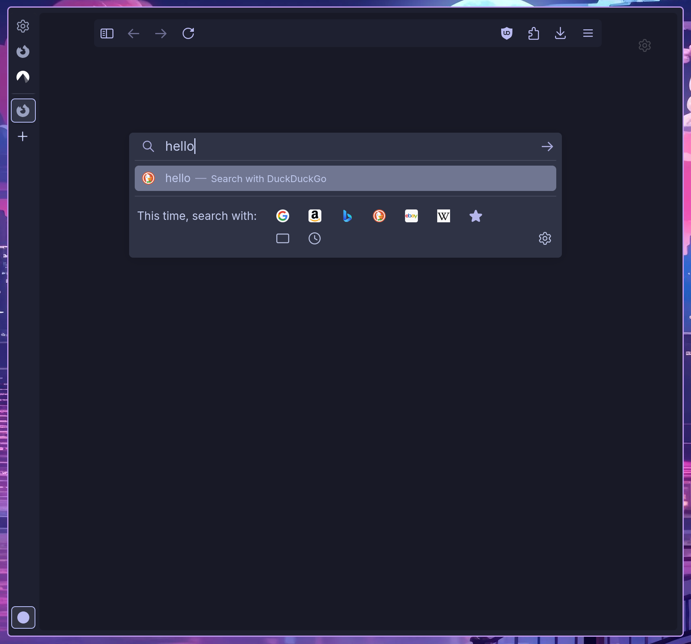
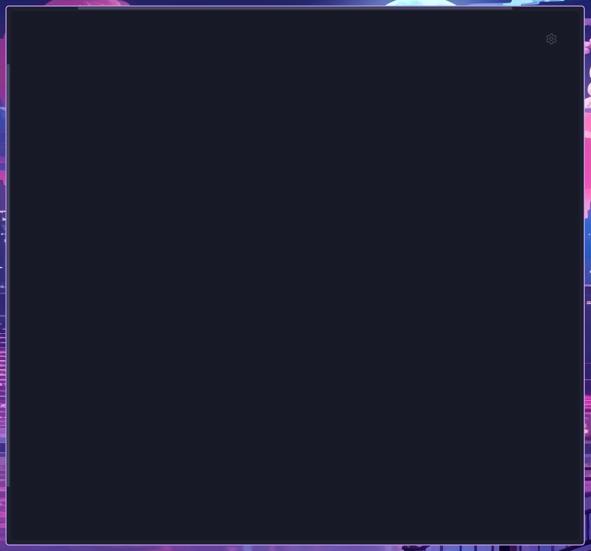
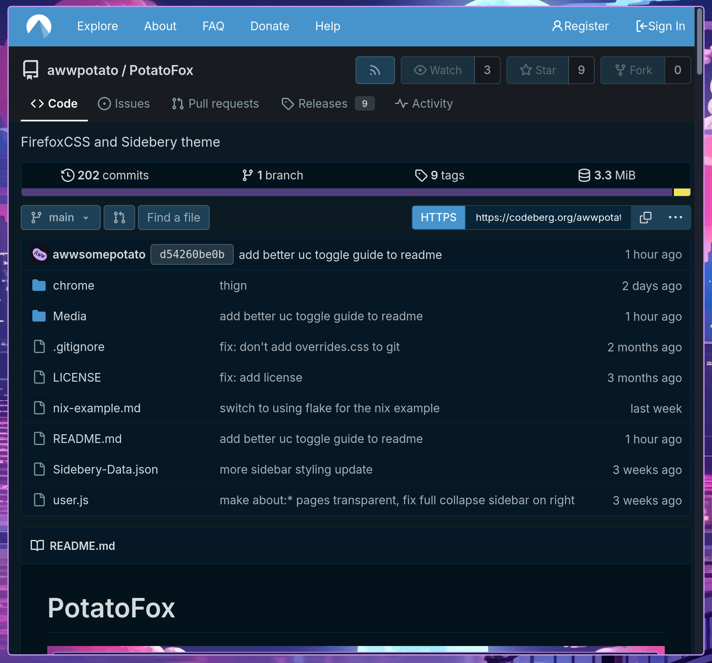
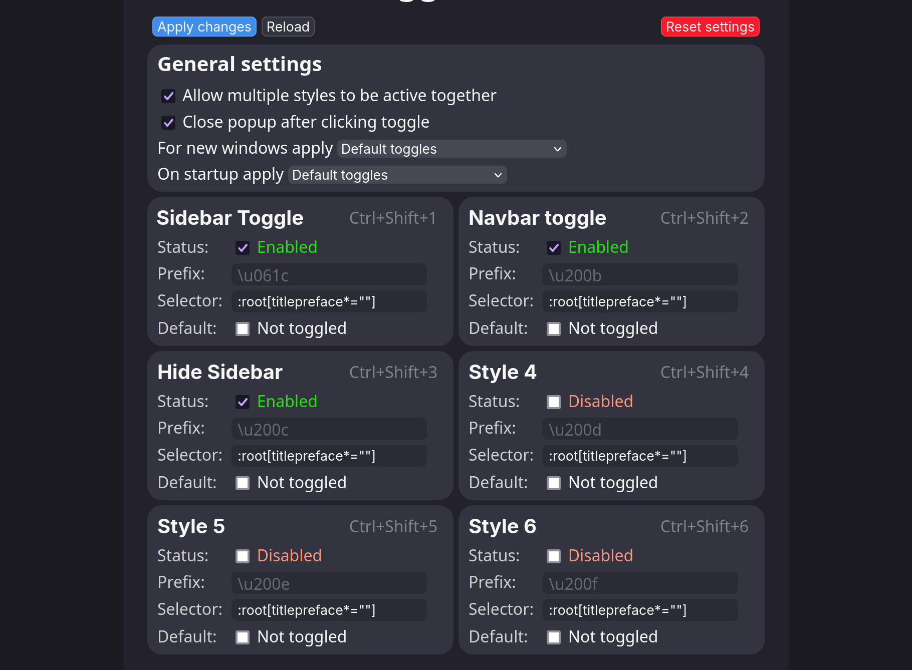

# PotatoFox



## Compatibility

Tested on Linux and MacOS, hasn't been tested on Windows recently. 

## Features

- collapsing vertical tabs using Sidebery 
- pop-up arc-like urlbar
- option to hide the navbar  
- ability to remove borders around webpage for an ultra minimal experience
- general visual enhancements  
- custom SVG icons for some extensions
- support for vertical tabs on the left or right

## Screenshots











## Install Instructions

Extension:

* [Sidebery](https://addons.mozilla.org/en-US/firefox/addon/sidebery)
* [Userchrome Toggle Extended](https://addons.mozilla.org/en-US/firefox/addon/userchrome-toggle-extended)
* [Firefox Color](https://addons.mozilla.org/en-US/firefox/addon/firefox-color) (optional)

Open the [releases tab](https://codeberg.org/awwpotato/PotatoFox/releases) and download the correct release for your version of Firefox (Urlbar > about:support > Application Basics > Version). Then copy the chrome directory and user.js file into your Firefox profiles directory (about:support > Application Basics > Profile Directory), then restart Firefox.

<details><summary>Advanced (cli) install (macOS/Linux)</summary>

#### Using git
```bash
git clone https://codeberg.org/awwpotato/potatofox.git
cd potatofox
ln -sr user.js chrome ~/.mozilla/firefox/<profile> # Linux
cp -r user.js chrome ~/Library/Application Support/Firefox/Profiles/<profile> # macOS 
```
#### Using [Nyoom](https://github.com/ryanccn/nyoom)
```bash
nyoom profile <profile-dir>
nyoom add codeberg:awwpotato/potatofox
nyoom switch potatofox
```
> [!NOTE]
> Make sure to install the required extensions.

</details>

## Post Install

- Import Sidebery config (Sidebery Settings > Help > Import addon data)
- Import Firefox Color [Theme](https://color.firefox.com/?theme=XQAAAAJIBAAAAAAAAABBqYhm849SCicxcUcPX38oKRicm6da8pG5gi-DrbS7fiEFLUzDsWXWyUHMSkHZ2PpRK_LvZGTF44fp7VnVXujpkKMjvOWQSIhdK22u1ZG2EgdMyNMx_0oKJ3H6SApxy3IyQ4DsJp5wXsJAe_-1mtgSkcENWz1hZ1gghq0xhXl6UO7VspWfsQ6vJg4Ug3n663qkVw8bLSpiIq6UZ0-WUMbVBt7-ALPxPVUB-S7EPdTdzkJxPMClIwcHP0JDv5qZANQwxTiL2qj3_6MMlX4Na3E2OdRK5C2gEjJ1vGxiNAKeqBLL9Caj1vDy56y6TcHlP-TGTBwju0MmWd88BWnnY33UAPhE85EIfBuQUUnOnDqE6ZvhrtBP-6mKMqcw4glFV5aTWHSlcIC22vuWuOBLdbRLJqDRGsFnQKuEWjwqlaZnkW00cfW6xFXES7FucYe45hz-JavOj-MRgeUprXgrziCzafFv9-HiTWYGsMrlhXAfFJmBStDWZJ1SlgDb5Vzorbe6Fg-eI9y9GPXEAFBbRIbn_rg5AaqGyHNq2SpI54ScDANxdzzbzy3R7Q67qcFXl3TEXU431c__1t8ujg) (Optional)
- about:addons (url) > Userchrome Toggle Extended preferences > General settings > allow multiple styles to be active together, apply changes 

> [!NOTE]
> On Linux there may be extra padding before/after the window controls, this can be fixed by changing line 36-38 in `chrome/vars.css`

> [!NOTE]
> If fingerprinting is a concern for you, I recommend enabling `uc.tweak.no-custom-icons` and removing `svg.context-properties.content.enabled` from `user.js`

### Recommended Userchrome Toggle Extended settings


### about:config tweaks 

* `uc.tweak.borderless` -> removes margins around the webpage
* `uc.tweak.sidebar-header` -> show sidebar header
* `sidebar.position_start` -> whether the sidebar is on the left or right
* `uc.tweak.sidebery-top-navbar` -> move the Sidebery navbar thingy from the bottom to the top
* `uc.tweak.no-custom-icons` -> removes theming of some extensions icons
* `uc.tweak.no-window-controls` -> hide window controls
* `uc.tweak.regular-search` -> return urlbar to original state
* `uc.tweak.no-panel-hint` -> hide the small bars showing location of hidden panels
* `uc.tweak.translucency` -> **EXPERIMENTAL** translucency support
* `browser.tabs.allow_transparent_browser` -> allow tab contents to have transparent bg, know to break websites with a white bg (requires `uc.tweak.translucency`)

### Advanced Configuration
The variables used by the theme are in `vars.css` and `userChrome.css` (colors). If you would like to ensure there aren't git conflicts you can add a `overrides.css` file in the `chrome` file and override the variables from `vars.css` in there (using `!important;` is necessary). Keep in mind the theme defaults to using `uidensity="compact"`, so you will want to change the variables inside there.
 
## Credits

[KiKaraage](https://github.com/KiKaraage/ArcWTF) - ArcWTF

[Shina-SG](https://github.com/Shina-SG/Shina-Fox) - Shina-Fox

[artsyfriedchicken](https://github.com/artsyfriedchicken/EdgyArc-fr) - EdgyArc-fr

[Naezer](https://github.com/Naezr/ShyFox) - ShyFox

## Mirrors

Currently Potatofox is available on [codeberg](https://codeberg.org/awwpotato/PotatoFox) (main) and [git.gay](https://git.gay/awwpotato/PotatoFox) (backup)
